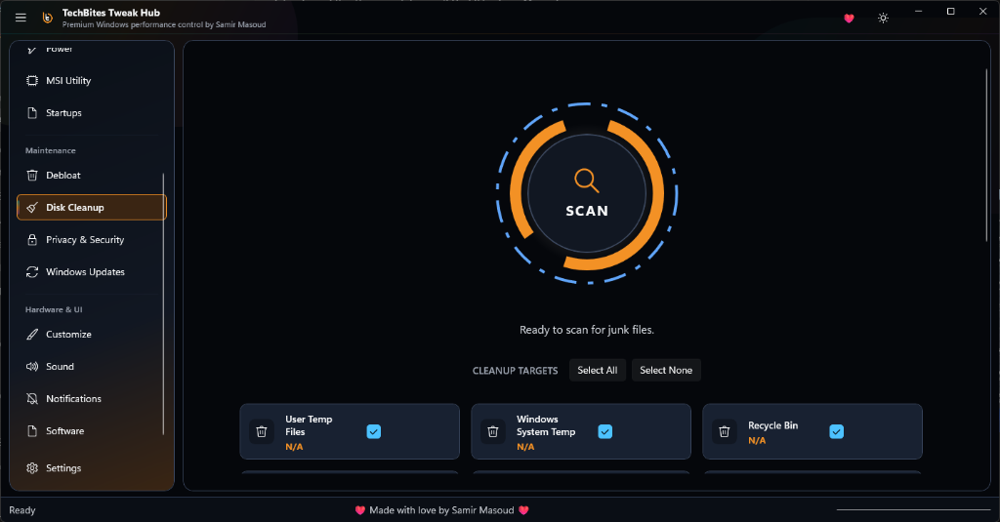
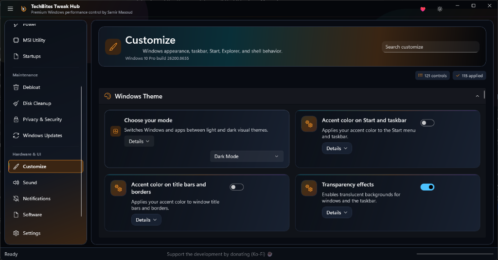

  

  # TechBites TweakHub

  **The Ultimate Windows Customization & Performance Optimization Suite**

  
  
  

  [Overview](#overview) • [Features](#key-features) • [Installation](#installation) • [Usage](#usage) • [Tech Stack](#tech-stack) • [Contributing](#contributing)

---

## 🌟 Overview
 
**TechBites TweakHub** is a comprehensive, modern Windows application designed to help you unlock the full potential of your PC. Built with the latest WinUI 3 technologies, TweakHub provides an elegant and intuitive interface for system tuning, memory management, and advanced Windows tweaking.

Whether you're a gamer looking for maximum frame rates, a power user wanting deeper control over your OS, or someone seeking to debloat their system, TweakHub brings all the essential tools into one unified hub.

---

## 📸 Inside TweakHub

Experience a beautiful, Dark Mode-first WinUI 3 interface designed for both aesthetics and ultimate functionality.

  <table style="width:100%">
    <tr>
      <td align="center" width="50%"> <b>Robust Restore Points</b></td>
      <td align="center" width="50%"> <b>Deep Windows Optimization</b></td>
    </tr>
    <tr>
      <td align="center" width="50%"> <b>Thorough Disk Cleanup</b></td>
      <td align="center" width="50%"> <b>Appearance & UI Customization</b></td>
    </tr>
  </table>

---

## 🚀 Key Features

### ⚡ Performance Optimization
- **System Debloating:** Safely remove unnecessary background processes and pre-installed Windows apps to free up resources.
- **Service Tweaking:** Optimize Windows services for specific workloads (Gaming, Productivity, or Battery Saving).

### 🧠 Advanced Memory Management
- **Intelligent RAM Cleaning:** Integrated with industry-leading tools like `RamMap` and `EmptyStandbyList` to securely clear your standby list and modified page lists.
- **Real-time Monitoring:** Keep an eye on system resources with zero-overhead telemetry.

### 🎨 UI Customization
- **Modern Experience:** A gorgeous, fluent design interface powered by WinUI 3, fully supporting Windows 11 design guidelines, Dark Mode, and Mica materials.
- **Deep Windows Customization:** Tweak Taskbar behaviors, File Explorer settings, and hidden Windows features with a single click.

### 🤖 AI-Powered Capabilities (Experimental)
- Incorporating OnnxRuntime and Windows AI capabilities for smart optimizations and recommendations tailored to your hardware and usage patterns.

---

## ⚙️ Installation

1. Go to the [Releases](https://github.com/SamirMasoudTechBites/TechBites-Tweak-Hub/releases) page.
2. Download the latest `.exe` .
3. Run `TechBites TweakHub.exe`.

> **Note:** Administrator privileges may be required to apply certain system tweaks.

---
## 💖 Support & Donate

If you find **TechBites TweakHub** useful, please consider supporting the development!

- 📺 **Subscribe on YouTube:** [@TechBites_SamirMasoud](https://www.youtube.com/@TechBites_SamirMasoud)
- ☕ **Donate via PayPal:** [paypal.me/TechBitesSamirMasoud](https://www.paypal.com/paypalme/TechBitesSamirMasoud)
- 💸 **Donate via InstaPay:** [instapay/7von5o](https://ipn.eg/S/samirmasoudtb/instapay/7von5o)

Your support keeps the updates coming!

---

## 🛡️ Disclaimer & License

**Disclaimer:** Use this software at your own risk. While we have tested these tweaks thoroughly, applying system-level changes can sometimes lead to unexpected behavior. Always create a System Restore point before applying major tweaks.

**License:** 
Portions of this repository (such as the tweak scripts and documentation) are distributed under the **[MIT License](https://opensource.org/license/mit)**. However, please note that **TechBites TweakHub is not fully open-source**. The core application is proprietary software. See the `LICENSE` file for more information on the open-source components.

---

  <i>Developed with ❤️ by <a href="https://github.com/SamirMasoudTechBites">Samir Masoud / TechBites</a></i>

