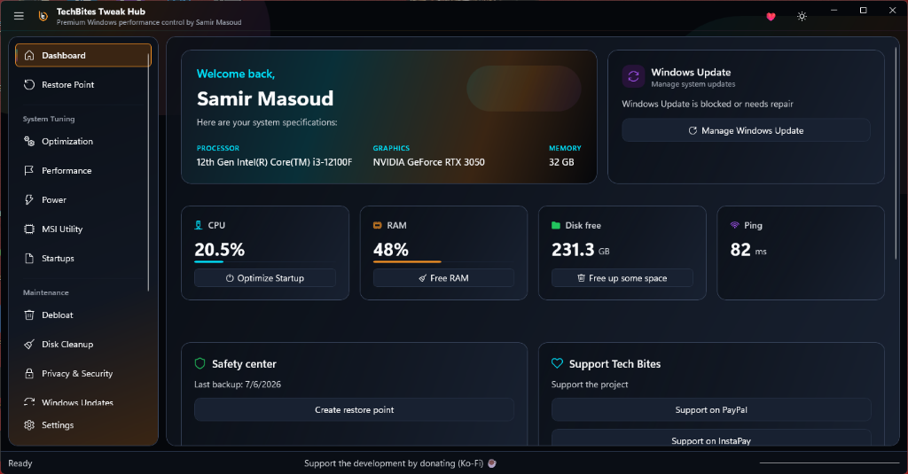
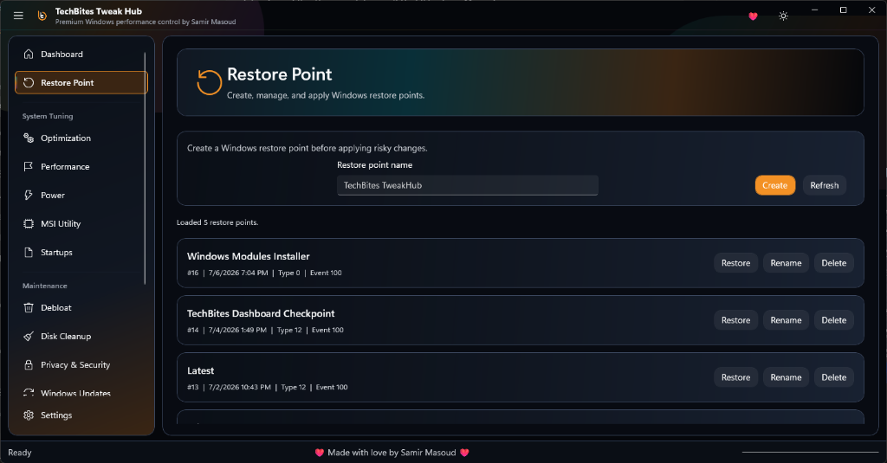
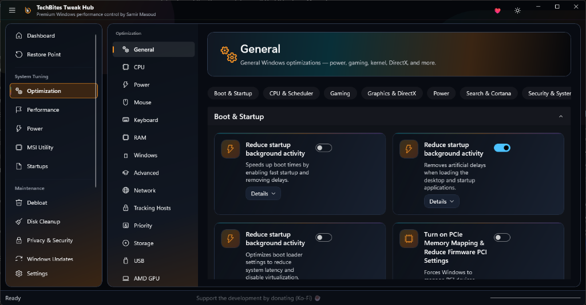

# <div align="center">



# 🚀 TechBites TweakHub

### The Ultimate Windows Optimization & Customization Suite

Modern • Powerful • Safe • Built for Windows 11

[](https://www.microsoft.com/windows)
[](https://microsoft.github.io/microsoft-ui-xaml/)
[](https://dotnet.microsoft.com/)
[](LICENSE)

### ⚡ One Hub. Every Windows Tweak.

Designed for gamers, creators, enthusiasts, and power users who want maximum performance without spending hours editing the registry.

**⭐ If you enjoy this project, don't forget to Star the repository!**

</div>

---

# 📖 Overview

**TechBites TweakHub** is an all-in-one Windows optimization utility built using **WinUI 3** and modern Windows technologies.

Instead of downloading dozens of utilities, scripts, and registry tweaks from different places, TweakHub combines everything into one elegant application with a modern Windows 11 interface.

Whether you want to:

* 🎮 Increase gaming performance
* 🚀 Speed up Windows
* 🧹 Clean unnecessary files
* 🎨 Customize Windows
* 🧠 Optimize RAM
* ⚙️ Apply advanced system tweaks

TweakHub gives you complete control in just a few clicks.

---

# ✨ Features

## 🚀 Performance Optimization

* Windows Debloating
* Background Service Optimization
* Startup Optimization
* Scheduled Task Cleanup
* Gaming Performance Presets
* Power Plan Tweaks
* Registry Optimizations
* CPU Scheduling Tweaks

---

## 🧠 Memory Optimization

Powered by trusted Microsoft utilities and industry-standard tools.

Features include:

* RAMMap Integration
* EmptyStandbyList Integration
* Working Set Cleanup
* Modified Page List Cleanup
* Standby Memory Cleanup
* Memory Usage Monitoring

---

## 🎨 Windows Customization

Personalize Windows exactly how you like it.

Available tweaks include:

* Taskbar Tweaks
* Explorer Tweaks
* Context Menu Tweaks
* Desktop Tweaks
* Dark Mode
* Hidden Windows Features
* Visual Effects
* Mica & Fluent Design Support

---

## 🧹 System Cleanup

Keep Windows running like new.

Includes:

* Temporary Files Cleanup
* Windows Update Cleanup
* Browser Cache Cleanup
* Recycle Bin Cleanup
* Prefetch Cleanup
* Delivery Optimization Cache Cleanup

---

## 🛡️ System Protection

Safety always comes first.

Before making major changes, TweakHub can:

* Create Restore Points
* Backup Registry Keys
* Restore Default Settings
* Undo Applied Tweaks

---

## 🤖 AI Features *(Experimental)*

Future versions will include AI-powered recommendations using Windows AI and ONNX Runtime.

Examples include:

* Automatic performance recommendations
* Hardware-aware tweak suggestions
* Smart optimization profiles
* Personalized Windows tuning

---

# 📸 Screenshots

## Dashboard


---

## Restore Point Manager



---

## Optimization Center



---

## Disk Cleanup


---

## Customization


---

# ⚙️ Installation

1. Download the latest release from the **Releases** page.
2. Extract the archive if necessary.
3. Run:

```text
TechBites TweakHub.exe
```

Administrator privileges are recommended for applying system tweaks.

---

# 💻 System Requirements

| Component        | Requirement              |
| ---------------- | ------------------------ |
| Operating System | Windows 11 (Recommended) |
| Architecture     | x64                      |
| RAM              | 4 GB Minimum             |
| Storage          | 300 MB                   |
| .NET             | Included                 |


---

# ❤️ Support Development

If TechBites TweakHub helped improve your PC, consider supporting the project.

## 📺 YouTube

https://www.youtube.com/@TechBites_SamirMasoud

## ☕

PayPal

https://www.paypal.com/paypalme/TechBitesSamirMasoud

## 💸 InstaPay

https://ipn.eg/S/samirmasoudtb/instapay/7von5o

Every contribution helps improve the project.

---

# ⚠️ Disclaimer

This software modifies Windows settings.

Although every tweak is tested before release, no software can guarantee compatibility with every Windows installation.

Always create a Restore Point before applying advanced tweaks.

Use this software at your own risk.

---

# 📜 License

TechBites TweakHub is **source-available but not fully open source**.

Some components (documentation, tweak scripts, and supporting files) are released under the MIT License.

The WinUI application, interface, branding, assets, and proprietary logic remain the intellectual property of TechBites.

See the LICENSE file for full details.

---

# 🤝 Contributing

Bug reports, feature requests, and feedback are always welcome.

Please open an Issue before submitting major changes.

---

# ⭐ Star the Project

If you like TechBites TweakHub, consider giving the repository a ⭐.

It helps the project grow and motivates future development.

---

<div align="center">

Made with ❤️ by **Samir Masoud (TechBites)**

**Thank you for supporting the project!**

</div>
