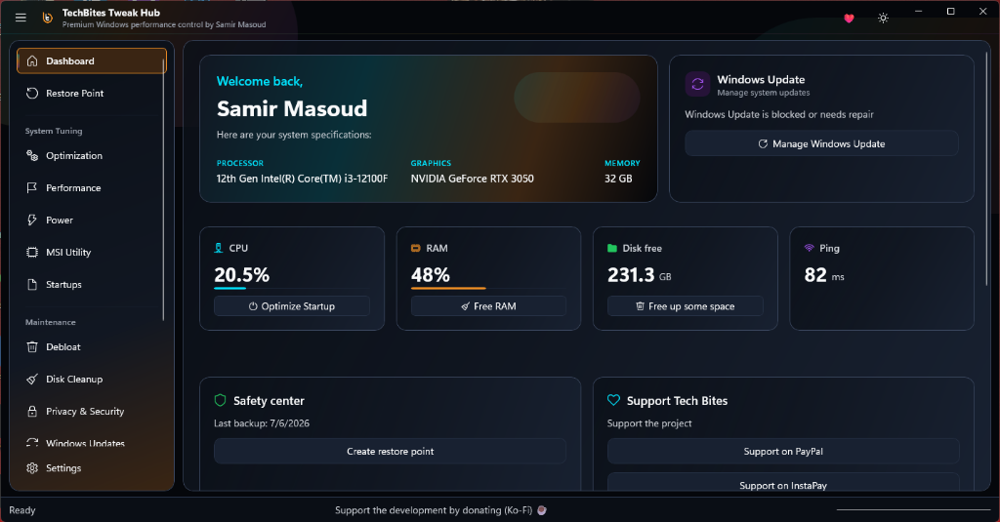
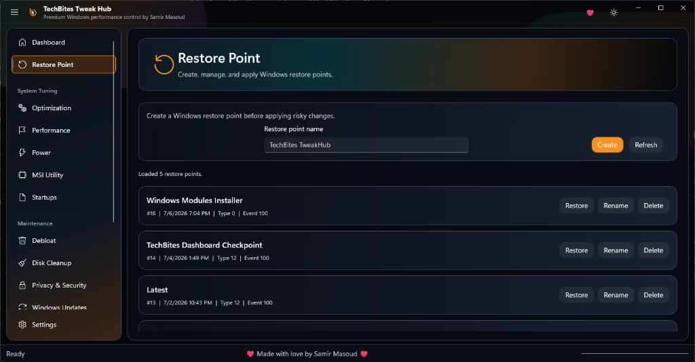
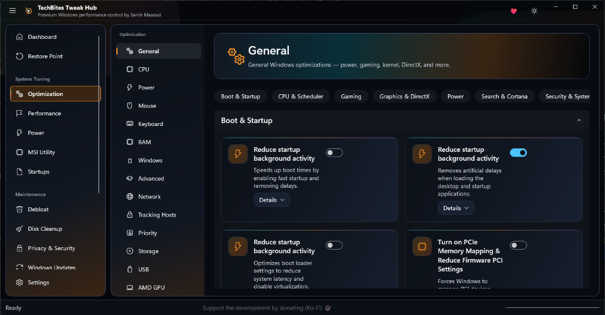
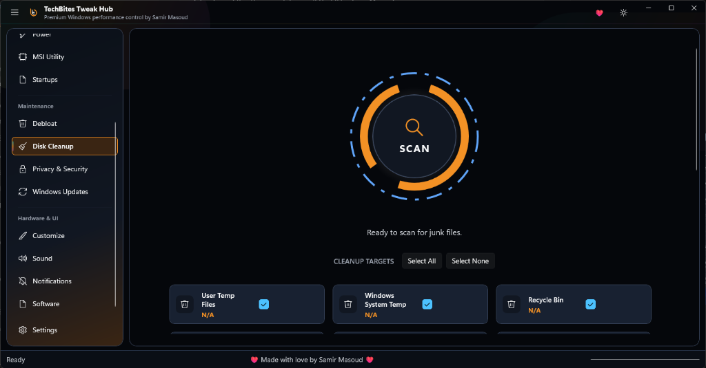
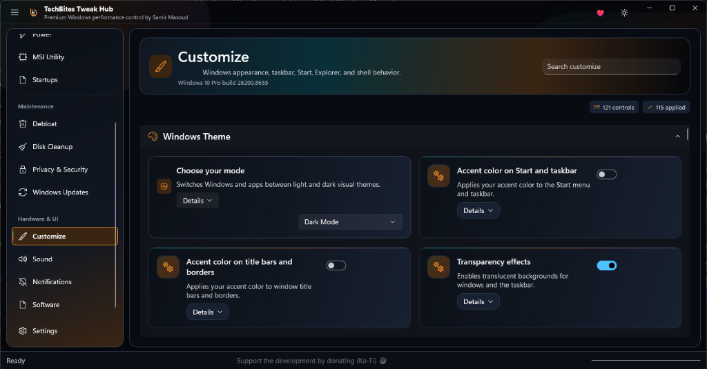

# ⚡ TechBites TweakHub

### *The Ultimate Windows Optimization, Gaming Performance & Latency Suite*

<!-- Animated typing tagline -->

 

[-0078D4?style=for-the-badge&logo=windows11&logoColor=white)](https://www.microsoft.com/windows)

 

**⭐ If TechBites TweakHub supercharges your system and elevates your gaming, star this repo on GitHub — it fuels continuous development!**

[**⬇ Download Official Installer V3**](https://github.com/SamirMasoudTechBites/TechBites-Tweak-Hub/releases) • [**💬 Report an Issue / Suggestion**](https://github.com/SamirMasoudTechBites/TechBites-Tweak-Hub/issues) • [**📺 Official YouTube Channel**](https://www.youtube.com/@TechBites_SamirMasoud)

---

## 📑 Table of Contents

- [Why TechBites TweakHub Stands Out](#-why-techbites-tweakhub-stands-out)
- [🔥 Comprehensive Feature Suite](#-comprehensive-feature-suite)
  - [1. 🎮 Smart Game Engine & Automatic Detection](#1--smart-game-engine--automatic-detection)
  - [2. ⚡ NVIDIA DRS & Deep Driver Optimization Studio](#2--nvidia-drs--deep-driver-optimization-studio)
  - [3. ⏱️ Ultra-Low Latency, DPC & MSI Mode Engine](#3-️-ultra-low-latency-dpc--msi-mode-engine)
  - [4. 🔋 Advanced Power Management & CPU Governor](#4--advanced-power-management--cpu-governor)
  - [5. 🧠 Enterprise RAMMap & Memory Optimization](#5--enterprise-rammap--memory-optimization)
  - [6. 🚀 Windows Debloater & Privacy Armor](#6--windows-debloater--privacy-armor)
  - [7. 🧹 Deep Disk, Cache & WinSxS Cleaner](#7--deep-disk-cache--winsxs-cleaner)
  - [8. 🛠️ 1-Click System Repair & Windows Fixes](#8-️-1-click-system-repair--windows-fixes)
  - [9. 📱 Dedicated GameLoop & PUBG Mobile Optimizer](#9--dedicated-gameloop--pubg-mobile-optimizer)
  - [10. 📋 Profiles Engine & Cloud Saves Synchronization](#10--profiles-engine--cloud-saves-synchronization)
  - [11. 🎨 Fluent Desktop Customization & Cursors](#11--fluent-desktop-customization--cursors)
  - [12. 📦 Integrated Software & Gaming Runtime Store](#12--integrated-software--gaming-runtime-store)
  - [13. 📊 Real-Time Telemetry, Desktop Widget & Tray Dashboard](#13--real-time-telemetry-desktop-widget--tray-dashboard)
  - [14. 🔄 Atomic In-Place Live Component Updater](#14--atomic-in-place-live-component-updater)
  - [15. 🛡️ Bulletproof System Protection & Rollback Safety Net](#15-️-bulletproof-system-protection--rollback-safety-net)
- [📸 Screenshots](#-screenshots)
- [🛡️ Security, Cryptography & VirusTotal Audit](#-security-cryptography--virustotal-audit)
- [⚙️ Quick Start & Installation](#-quick-start--installation)
- [💻 System Requirements](#-system-requirements)
- [❤️ Support the Creator](#-support-the-creator)
- [📜 License & Disclaimer](#-license--disclaimer)

---

## 🌟 Why TechBites TweakHub Stands Out

Most Windows "tweakers" are fragile, single-shot batch scripts or bloated wrappers that break Windows Update, corrupt drivers, and trigger anti-cheat bans. 

**TechBites TweakHub** is completely different:
- **Engineered from Scratch in C# / .NET 8** with a native **WinUI 3 Fluent interface** utilizing hardware-accelerated Mica and Acrylic effects.
- **Hardware-Aware & Game-Aware**: Knows what CPU, GPU, RAM, and games you actually have installed and tailors configurations to your specific hardware.
- **Zero-Risk Reversibility**: Built-in Restore Point manager, registry diff backups, and instant one-click rollback for every single tweak.
- **Enterprise-Grade Memory Tools**: Embeds real Sysinternals-grade memory management (`RAMMap` / `EmptyStandbyList`) to purge standby caches that cause micro-stutters.
- **No Manual Zip Updates**: Features an atomic background updater with live visual progress feedback and ECDSA cryptographic verification.

<table>
<tr>
<td width="33%" align="center">
<h3>🎮 Smart Game Detection</h3>

Scans your drives to detect installed games automatically and applies competitive, zero-delay engine presets.

</td>
<td width="33%" align="center">
<h3>⚡ Deep NVIDIA DRS Studio</h3>

Complete control over hidden NVIDIA driver profile flags, low-latency queues, and hardware frame limiters.

</td>
<td width="33%" align="center">
<h3>🚀 MSI Mode & DPC Latency</h3>

Prioritizes GPU and network interrupts to dedicated hardware queues to eliminate micro-stutters.

</td>
</tr>
<tr>
<td width="33%" align="center">
<h3>🧠 RAMMap Memory Engine</h3>

Reclaims leaked memory, purges swollen standby lists, and optimizes working sets in real-time.

</td>
<td width="33%" align="center">
<h3>🔋 Ultimate Power Schemes</h3>

Unlocks hidden CPU core parking parameters, disable idle states, and stabilizes maximum clock speeds.

</td>
<td width="33%" align="center">
<h3>🛡️ Bulletproof Rollback</h3>

Automatic system restore points, registry backups, and 1-click restore guarantee zero system risk.

</td>
</tr>
</table>

---

## 🔥 Comprehensive Feature Suite

### 1. 🎮 Smart Game Engine & Automatic Detection
- **Intelligent Drive Scanner**: Deeply scans Steam, Epic Games, Riot, Ubisoft, EA App, Battle.net, and custom install directories to display **only verified, installed games** — zero clutter or irrelevant titles.
- **Engine-Level Competitive Presets**: Precision config injection targeting competitive frametime stability for:
  - *Valorant, Counter-Strike 2 (CS2), PUBG: BATTLEGROUNDS, Fortnite, Call of Duty: Warzone, Apex Legends, Rainbow Six Siege, GTA V / FiveM, Overwatch 2, League of Legends, Dota 2*, and more.
- **DirectX & Vulkan Shader Pipeline**: Optimizes shader pre-caching, disables async compute delays where beneficial, and optimizes CPU draw call thread dispatching.
- **DirectX Graphics Infrastructure (DXGI) Tuning**: Forces native flip model (`DXGI_SWAP_EFFECT_FLIP_DISCARD`), bypasses DWM compositor overhead, and strips forced fullscreen latency.
- **Game DVR & Xbox Capture Stripping**: Eradicates background game clip recording and telemetry processes that steal GPU encoding resources.

---

### 2. ⚡ NVIDIA DRS & Deep Driver Optimization Studio
- **Driver Profile Import & Export**: Directly interfaces with the NVIDIA driver DRS API to import, backup, and restore custom game profiles without requiring third-party tools.
- **Hidden Driver Flag Controls**: Fine-tune deep driver parameters normally invisible in the standard NVIDIA Control Panel:
  - Ultra-Low Latency Mode (Reflex driver-level queuing).
  - Maximum Pre-Rendered Frames configuration.
  - Anisotropic Filtering optimizations and Clamp Negative LOD Bias.
  - Threaded Optimization enforcement.
  - Power Management Mode (*Prefer Maximum Performance* locked at hardware level).
  - Variable Refresh Rate (VRR / G-Sync) frametime alignment.
  - Deep DLSS / DLDSR / Reflex hardware pipeline configurations.

---

### 3. ⏱️ Ultra-Low Latency, DPC & MSI Mode Engine
- **MSI Utility (Message Signaled Interrupts)**: Converts GPU, NVMe controller, USB 3.0/3.1 controllers, and Ethernet/Wi-Fi adapters from legacy line-based Pin-IRQs to high-speed MSI mode.
- **Interrupt Priority Tuning**: Sets GPU and Network Card interrupt priority to *High*, assigning dedicated vector queues for near-instant mouse and network packet delivery.
- **BCD OS Kernel Tweaks**:
  - Sets `useplatformclock` and dynamic tick tuning to eliminate timer jitter.
  - Configures optimal memory page tables for gaming responsiveness.
- **DPC Latency Monitoring & Reduction**: Locates and suppresses driver interrupts causing system-wide latency spikes.

---

### 4. 🔋 Advanced Power Management & CPU Governor
- **TechBites Ultimate Performance Schemes**: Installs custom, unthrottled power plans that expose and unlock hidden Windows ACPI attributes.
- **CPU Core Parking Elimination**: Prevents Windows scheduler from parking CPU performance cores during gaming sessions.
- **CPU Frequency Scaling & Idle State Tuning**: Locks minimum processor frequency state at 100% to eradicate frequency ramp-up latency.
- **USB Selective Suspend & PCI Express Link State**: Disables power-saving downclocking on USB ports (prevents mouse sensor drops) and PCIe slots.

---

### 5. 🧠 Enterprise RAMMap & Memory Optimization
- **Sysinternals-Grade Memory Flusher**: Integrates `RAMMap` and `EmptyStandbyList` execution engines directly into the application.
- **Standby List Instant Purge**: Windows often hoards gigabytes of cached files in the standby list, leading to hitching when memory is requested. TweakHub clears this with 1 click.
- **Working Set & Modified Page Reclamation**: Reclaims unmapped physical pages without crashing or freezing running software.
- **Real-Time Memory Telemetry**: Monitors Committed, Cached, Paged Pool, and Non-Paged Pool memory in real time.

---

### 6. 🚀 Windows Debloater & Privacy Armor
- **UWP & Bloatware Stripper**: Safely uninstalls preinstalled Windows bloatware (Cortana, News & Interests, Feedback Hub, Xbox redundant components, OEM trialware).
- **Comprehensive Telemetry Shield**:
  - Blocks Diagnostic Data (Telemetry) collection and Customer Experience Improvement Program (CEIP).
  - Blocks Microsoft telemetry IP addresses and endpoints at the Windows Firewall and hosts level.
  - Disables Activity History, Tailored Experiences, and Advertising ID tracking.
- **Background Service Optimizer**: Safely disables non-essential background Windows services that eat CPU cycles (Print Spooler, Remote Registry, Diagnostic Execution, SmartScreen telemetry).
- **Scheduled Tasks Cleaner**: Prunes hundreds of hidden telemetry and telemetry consolidation tasks scheduled by Windows Task Scheduler.

---

### 7. 🧹 Deep Disk, Cache & WinSxS Cleaner
- **WinSxS Component Store Pruning**: Cleans superseded updates and accumulated Windows component caches (`DISM /Cleanup-Image`).
- **Delivery Optimization & Windows Update Cache**: Wipes multi-gigabyte leftover Windows Update delivery files and update caches.
- **Browser & Shader Cache Engine**: Cleans Direct3D, OpenGL, Vulkan, and DirectX shader caches along with Chromium browser temporary data.
- **System Junk & Prefetch Scrubber**: Cleans user/system `%TEMP%`, crash dumps, mini-dumps, memory error reports, and log debris.

---

### 8. 🛠️ 1-Click System Repair & Windows Fixes
- **DISM & SFC Integrity Repair**: Automatically executes automated image repair (`DISM /RestoreHealth`) followed by full system file checker verification (`SFC /scannow`).
- **Network Stack & Winsock Reset**: 1-click flushes DNS cache, resets Winsock catalog, and refreshes TCP/IP configurations to solve ping spikes and packet loss.
- **Windows Update Diagnostic Repair**: Re-registers update service DLLs and rebuilds `SoftwareDistribution` catalog to resolve stuck update loops.
- **Print Spooler & Windows Search Rebuilders**: Fixes frozen or crashing background subsystems without rebooting.

---

### 9. 📱 Dedicated GameLoop & PUBG Mobile Optimizer
- **Direct Tencent/GameLoop Integration**: Tailored specifically for emulator competitive players.
- **DirectX+ / OpenGL+ Engine Switching**: Optimizes emulator rendering backend, memory allocation, and CPU thread mapping.
- **VMM & Hyper-V Diagnostics**: Detects virtualization bottlenecks and configures proper hypervisor settings for smooth 90 FPS/120 FPS emulation.
- **Config & Resolution Overrides**: Applies custom configuration files for clean 2K/4K rendering and ultra-crisp crosshairs.

---

### 10. 📋 Profiles Engine & Cloud Saves Synchronization
- **One-Click Curated Presets**:
  - 🏎️ **Extreme Gaming Profile**: All-out performance, lowest input latency, aggressive background stripping.
  - 🎥 **Streamer & Creator Profile**: High-performance optimization preserving NVENC encoding, audio subsystems, and multi-monitor capture.
  - ⚡ **Productivity Profile**: Snappy system responsiveness with full printer, scanner, and office service preservation.
  - 🛡️ **Balanced / Safe Profile**: Gentle optimizations that keep all Windows default behaviors intact.
- **Custom Profile Builder**: Build, name, export, and share your own personalized tweak recipes (`.json`).
- **Cloud Saves Synchronization**: Backup and synchronize your game configs and tweak profiles across multiple devices using integrated cloud storage.

---

### 11. 🎨 Fluent Desktop Customization & Cursors
- **Classic Context Menu**: Instantly restore the fast, responsive Windows 10 right-click menu on Windows 11 with zero delay.
- **TechBites Custom Cursors**: Install hand-crafted, high-visibility competitive gaming cursor packs.
- **Taskbar & Explorer Tweaks**: Enable seconds in taskbar clock, hide search bar clutter, show file extensions, and display hidden files.
- **4K Tech & Gaming Wallpapers**: Browse and apply ultra-high-definition wallpapers curated for clean desktop setups.

---

### 12. 📦 Integrated Software & Gaming Runtime Store
- **1-Click Essential Gaming Runtimes**: Silently installs all Microsoft Visual C++ Redistributables (2005 through 2022, x86 and x64) and DirectX End-User Runtimes.
- **Must-Have PC Tools**: 1-click downloads for trusted enthusiast utilities:
  - *MSI Afterburner, RivaTuner Statistics Server (RTSS), HWInfo64, CPU-Z, GPU-Z, CapFrameX, 7-Zip, Notepad++, OBS Studio*.
- **Silent & Clean**: Installs directly from official vendor sources without bundled adware or unwanted toolbars.

---

### 13. 📊 Real-Time Telemetry, Desktop Widget & Tray Dashboard
- **Floating Speed Widget**: Compact, customizable on-screen widget displaying real-time CPU usage, RAM utilization, and system responsiveness metrics.
- **System Tray Resident Dashboard**: Quick-access tray menu enabling 1-click RAM flushing, power plan switching, and game boost toggling without opening the main window.
- **Post-Reboot Benchmark Comparator**: Measures system responsiveness, boot times, and memory headroom before and after applying optimizations to prove real gains.

---

### 14. 🔄 Atomic In-Place Live Component Updater
- **No Manual Downloads or Archive Extraction**: Checks and synchronizes updated components directly into your installation directory.
- **Dedicated Neon Visualizer**: Displays an ambient Cyber Amber progress indicator with live 0–100% progress and stage counters.
- **Cryptographic Payload Verification**: Every updated file is verified against SHA-256 hashes and ECDSA digital signatures before being committed.
- **Instant Seamless Restart**: Automatically finalizes updates and launches the renewed suite without leaving stale `.old` files behind.

---

### 15. 🛡️ Bulletproof System Protection & Rollback Safety Net
- **Automatic System Restore Point Creation**: Prompts and creates a Windows Restore Point before executing any deep registry or service alterations.
- **Registry Snapshot Engine**: Creates encrypted backups of original registry values prior to modification.
- **Universal Revert Engine**: Every single tweak in the app features an active state detector and a dedicated undo mechanism.

**[⬆ back to top](#-table-of-contents)**

---

## 📸 Screenshots

<table>
<tr>
<td align="center" width="50%">
 
<b>⚡ Modern Dashboard & System Status</b>
</td>
<td align="center" width="50%">
 
<b>🛡️ Restore Point & Safety Manager</b>
</td>
</tr>
<tr>
<td align="center" width="50%">
 
<b>🚀 Performance & Gaming Optimization Center</b>
</td>
<td align="center" width="50%">
 
<b>🧹 Deep Disk & Cache Cleanup Engine</b>
</td>
</tr>
<tr>
<td colspan="2" align="center">
 
<b>🎨 Fluent Windows 11 Customization & Tweaks</b>
</td>
</tr>
</table>

**[⬆ back to top](#-table-of-contents)**

---

## 🛡️ Security, Cryptography & VirusTotal Audit

User safety, privacy, and system stability are fundamental. Every official release of **TechBites TweakHub** undergoes multi-layer cryptographic verification and independent antivirus analysis.

| Security Attribute | Verified Value |
|---|---|
| **VirusTotal Status** |  |
| **SHA-256 Hash** | `b2f31dbd357c7e23be4b3332b64a7cd54a1cbbe06948d4a0ceb697552a2944f2` |
| **Digital Integrity** | Asymmetric ECDSA P-256 Signed Manifest |
| **Tamper Protection** | Memory Virtualization & Kernel Read Locks |
| **Live Scan Link** | 🔗 [Inspect Live VirusTotal Analysis Report](https://www.virustotal.com/gui/file/b2f31dbd357c7e23be4b3332b64a7cd54a1cbbe06948d4a0ceb697552a2944f2/detection) |

> [!NOTE]
> **Why do system tweaking suites sometimes trigger heuristic antivirus warnings?**  
> Because TweakHub modifies low-level Windows registry keys, adjusts driver parameters, and disables background telemetry tasks, aggressive generic heuristic scanners occasionally flag optimization tools as "System Modifiers" or generic "PUP". TweakHub is **100% clean, non-malicious, ad-free, and contains zero spyware**.

**[⬆ back to top](#-table-of-contents)**

---

## ⚙️ Quick Start & Installation

### 🚀 Standard 1-Click Setup (Recommended)
1. Download **`TechBites_Hub_Setup.exe`** from the latest [**GitHub Releases**](https://github.com/SamirMasoudTechBites/TechBites-Tweak-Hub/releases).
2. Run the installer and choose your installation options.
3. If prompted by Windows SmartScreen on fresh releases, click **More Info ➔ Run Anyway**.
4. Launch **TechBites TweakHub** and experience immediate system responsiveness!

> [!TIP]
> **Administrator Privileges:** TweakHub will request administrator permissions so it can interact with Windows services, power plans, and system registry branches safely.

**[⬆ back to top](#-table-of-contents)**

---

## 💻 System Requirements

| Specification | Minimum Requirement | Recommended |
|---|---|---|
| **Operating System** | Windows 10 (64-bit, 1909+) | Windows 11 (22H2 / 23H2 / 24H2) |
| **Architecture** | x64 (AMD / Intel) | x64 |
| **RAM** | 4 GB | 8 GB or higher |
| **Storage** | 350 MB free disk space | SSD / NVMe |
| **Privileges** | Local Administrator | Local Administrator |
| **Runtime** | Included in setup package | Pre-packaged .NET 8 / WinUI 3 |

---

## ❤️ Support the Creator

TechBites TweakHub is crafted with passion for the tech and gaming community. If TweakHub helped your PC run faster, smoother, and more responsively, consider supporting future development:

**[⬆ back to top](#-table-of-contents)**

---

## 🤝 Contributing & Community Feedback

Community feedback drives every single release of TechBites TweakHub!
- Found a bug or compatibility issue? Open an **[Issue on GitHub](https://github.com/SamirMasoudTechBites/TechBites-Tweak-Hub/issues)**.
- Have an idea for a new tweak or game profile? Submit a feature request via the issues tab!

---

## 📜 License

TechBites TweakHub is **source-available**:
- Supporting scripts, community tweak definitions, and documentation are provided under the **MIT License**.
- The compiled WinUI 3 application, branding assets, interface designs, and proprietary update architectures remain the intellectual property of **TechBites / Samir Masoud**.

For full licensing terms, please consult the [LICENSE](LICENSE) document.

---

## ⚠️ Disclaimer

TechBites TweakHub modifies Windows system settings, services, and registry values to achieve maximum gaming and computing performance. While every single tweak is tested across real-world hardware before deployment, hardware variations exist. **Always create a Windows Restore Point before applying major system modifications.** Software is provided as-is.

**Engineered with ❤️ for Gamers & Power Users by [Samir Masoud (TechBites)](https://www.youtube.com/@TechBites_SamirMasoud)**

